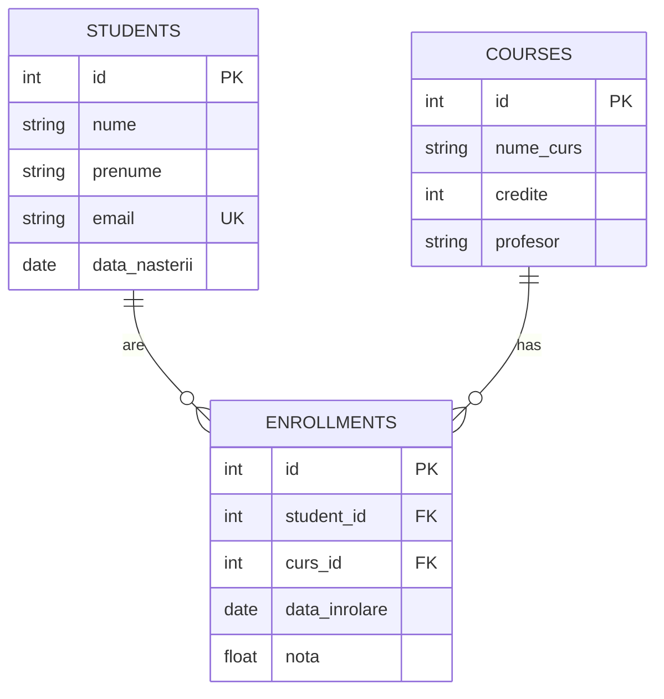
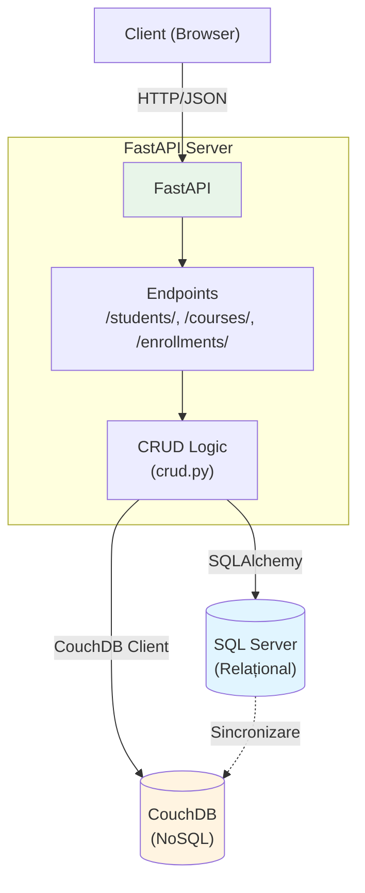

# Raport Tehnic - Sistem de Gestiune Studenți (Hibrid SQL + NoSQL)

## 1. Introducere

### 1.1 Scopul Proiectului
Acest proiect demonstrează integrarea unei baze de date relaționale (SQL Server) cu una NoSQL (CouchDB) prin intermediul unui API REST. Obiectivul este de a asigura sincronizarea bidirectională a datelor între cele două sisteme, menținând consistența informațiilor și oferind flexibilitatea oferită de ambele paradigme.

### 1.2 Obiective
- Implementarea unui API REST complet funcțional pentru gestionarea entităților: Studenți, Cursuri și Înrolări
- Sincronizarea automată a datelor între SQL Server (relațional) și CouchDB (document-oriented)
- Testarea consistenței datelor între cele două sisteme
- Dezvoltarea unei arhitecturi scalabile și ușor de întreținut

---

## 2. Tehnologii Utilizate

### 2.1 SQL Server (Relațional)
**Descriere**: Sistem de gestionare a bazelor de date relaționale dezvoltat de Microsoft.

**Motivația alegerii**:
- Model relațional matur pentru date structurate cu relații complexe (studenți ↔ cursuri)
- Suport excelent pentru integritatea referențială (chei străine)
- Performanță excelentă pentru interogări complexe (JOIN-uri)
- Cerință standard în industrie

### 2.2 CouchDB (NoSQL Document Store)
**Descriere**: Bază de date NoSQL orientată pe documente, cu protocoale HTTP/JSON native.

**Motivația alegerii**:
- Document-oriented storage permite flexibilitate în schema datelor
- Replicare și sincronizare nativă între instanțe
- API REST nativ (compatibil cu viziunea proiectului)
- Ideal pentru scenarii de denormalizare și citiri rapide

### 2.3 Python 3.12
**Descriere**: Limbaj de programare de nivel înalt, interpretat.

**Motivația alegerii**:
- Ecosistem bogat de biblioteci pentru baze de date
- Sintaxă clară și expresivă
- Suport excelent pentru dezvoltare web și API-uri

### 2.4 FastAPI
**Descriere**: Framework modern, rapid pentru construirea API-urilor REST în Python.

**Motivația alegerii**:
- Performanță superioară (bazat pe Starlette și Pydantic)
- Documentație automată (Swagger UI / ReDoc)
- Validare automată a datelor prin Pydantic
- Type hints și suport async/await nativ

### 2.5 SQLAlchemy
**Descriere**: ORM (Object-Relational Mapping) pentru Python.

**Motivația alegerii**:
- Abstractizare puternică peste SQL
- Portabilitate între diferite motoare SQL
- Suport pentru migrări și gestionare schema

### 2.6 Biblioteci Adiționale
- **pymssql**: Driver Python pur pentru SQL Server (nu necesită ODBC)
- **couchdb**: Client Python pentru CouchDB
- **pydantic**: Validare și serializare date
- **uvicorn**: Server ASGI pentru FastAPI

---

## 3. Model de Date

### 3.1 Baza de Date Relațională (SQL Server)

#### Tabelul `students`
| Câmp           | Tip          | Constrângeri        |
|----------------|--------------|---------------------|
| id             | INT          | PK, Identity        |
| nume           | NVARCHAR(100)| NOT NULL            |
| prenume        | NVARCHAR(100)| NOT NULL            |
| email          | NVARCHAR(150)| UNIQUE, NOT NULL    |
| data_nasterii  | DATE         | NOT NULL            |

#### Tabelul `courses`
| Câmp       | Tip          | Constrângeri  |
|------------|--------------|---------------|
| id         | INT          | PK, Identity  |
| nume_curs  | NVARCHAR(200)| NOT NULL      |
| credite    | INT          | NOT NULL      |
| profesor   | NVARCHAR(100)| NULL          |

#### Tabelul `enrollments`
| Câmp          | Tip   | Constrângeri          |
|---------------|-------|-----------------------|
| id            | INT   | PK, Identity          |
| student_id    | INT   | FK → students.id      |
| curs_id       | INT   | FK → courses.id       |
| data_inrolare | DATE  | NOT NULL              |
| nota          | FLOAT | NULL                  |

#### Diagrama Relațiilor (ER Diagram)



**Relații**:
- Un student poate avea **0 sau mai multe** înrolări (1:N)
- Un curs poate avea **0 sau mai mulți** studenți înrolați (1:N)
- Relația **many-to-many** între Students și Courses este implementată prin tabela de legătură `Enrollments`
- **CASCADE DELETE**: La ștergerea unui student/curs, se șterg automat toate înrolările asociate

### 3.2 Baza de Date NoSQL (CouchDB)

#### Document de tip `student`
```json
{
  "_id": "student_1",
  "_rev": "1-abc123",
  "type": "student",
  "id": 1,
  "nume": "Popescu",
  "prenume": "Ion",
  "email": "ion.popescu@example.com",
  "data_nasterii": "2000-01-01"
}
```

#### Document de tip `course`
```json
{
  "_id": "course_1",
  "_rev": "1-def456",
  "type": "course",
  "id": 1,
  "nume_curs": "Baze de Date Avansate",
  "credite": 6,
  "profesor": "Prof. Dr. Ionescu"
}
```

#### Document de tip `enrollment`
```json
{
  "_id": "enrollment_1",
  "_rev": "1-ghi789",
  "type": "enrollment",
  "id": 1,
  "student_id": 1,
  "curs_id": 1,
  "data_inrolare": "2025-11-27",
  "nota": null
}
```

**Observații**:
- `_id` și `_rev` sunt câmpuri CouchDB (gestionate automat)
- `type` permite filtrarea după tipul de document
- Denormalizarea datelor permite citiri rapide fără JOIN-uri
- **Toate cele 3 entități (studenți, cursuri, înrolări) sunt sincronizate automat**

---

## 4. Arhitectura Aplicației

### 4.1 Schemă Bloc Generală



**Flux de lucru**:
1. Client trimite request HTTP (POST/GET/PUT/DELETE)
2. FastAPI validează datele (Pydantic)
3. CRUD logic salvează în SQL Server
4. Sincronizarea automată propagă în CouchDB
5. Răspuns JSON către client

### 4.2 Descrierea Endpoint-urilor API

#### Students
- `POST /students/` - Creare student nou (+ sincronizare CouchDB)
- `GET /students/` - Listare studenți (cu paginare)
- `GET /students/{id}` - Detalii student specific
- `PUT /students/{id}` - Actualizare student (+ sincronizare CouchDB)
- `DELETE /students/{id}` - Ștergere student (+ ștergere din CouchDB)

#### Courses
- `POST /courses/` - Creare curs nou (+ sincronizare CouchDB)
- `GET /courses/` - Listare cursuri (cu paginare)
- `GET /courses/{id}` - Detalii curs specific
- `PUT /courses/{id}` - Actualizare curs (+ sincronizare CouchDB)
- `DELETE /courses/{id}` - Ștergere curs (+ ștergere din CouchDB)

#### Enrollments
- `POST /enrollments/` - Înrolare student la curs (+ sincronizare CouchDB)
- `GET /enrollments/` - Listare înrolări (cu paginare)
- `GET /enrollments/{id}` - Detalii înrolare specifică
- `PUT /enrollments/{id}` - Actualizare înrolare (+ sincronizare CouchDB)
- `DELETE /enrollments/{id}` - Ștergere înrolare (+ ștergere din CouchDB)

### 4.3 Flux de Lucru - Creare Student

```
1. Client trimite POST /students/ cu date JSON
   ↓
2. FastAPI validează datele (Pydantic)
   ↓
3. crud.create_student() salvează în SQL Server
   ↓
4. database_nosql.sync_student_to_couchdb() sincronizează
   ↓
5. Răspuns JSON către client (date + ID generat)
```

**Notă**: Același flux se aplică și pentru `POST /courses/` și `POST /enrollments/`. Toate entitățile sunt sincronizate automat în CouchDB la creare.

---

## 5. Sincronizare și Consistență

### 5.1 Direcția Sincronizării
**SQL Server → CouchDB** (unidirecțională)

- SQL Server este **sursa de adevăr** (source of truth)
- Orice modificare în SQL este propagată automat în CouchDB
- CouchDB servește pentru:
  - Backup
  - Citiri rapide (denormalizat)
  - Replicare pentru sisteme distribuite

### 5.2 Algoritmul de Sincronizare

```python
def sync_student_to_couchdb(student_data: dict):
    """
    1. Conectare la CouchDB
    2. Verificare dacă documentul există (după ID)
    3. Dacă există:
       - Actualizare câmpuri (păstrează _rev)
    4. Dacă nu există:
       - Creare document nou cu _id = "student_{id}"
    5. Salvare document
    """
```

**Aceste funcții există pentru toate cele 3 entități**:
- `sync_student_to_couchdb()` - pentru studenți
- `sync_course_to_couchdb()` - pentru cursuri
- `sync_enrollment_to_couchdb()` - pentru înrolări

**Timestamp-uri**: În versiunea actuală nu se folosesc timestamp-uri explicite, dar pot fi adăugate (`created_at`, `updated_at`) pentru tracking.

### 5.3 Rezolvarea Conflictelor

**Strategie actuală**: 
- SQL Server este întotdeauna corect (single source of truth)
- CouchDB nu modifică niciodată date independent
- Nu există conflicte pentru că scrierile vin doar din SQL

**Îmbunătățiri posibile**:
- Adăugare timestamp-uri pentru audit
- Implementare sincronizare bidirectională cu rezoluție pe bază de "last-write-wins"
- Vector clocks pentru sisteme distribuite

### 5.4 Verificarea Consistenței

**Metodă manuală**:
1. Interogare SQL: `SELECT * FROM students WHERE id = 1`
2. Interogare CouchDB: `GET /students_sync/student_1`
3. Comparare manuală a câmpurilor

**Automatizare sugerată** (pentru viitor):
```python
def verify_consistency(student_id: int):
    sql_data = get_student_from_sql(student_id)
    couch_data = get_student_from_couchdb(f"student_{student_id}")
    return sql_data == couch_data
```

---

## 6. Scenarii de Test și Rezultate

### 6.1 Rulare Teste Automate

#### Script de testare automată
Proiectul include un script Python care testează automat consistența datelor:

```bash
# Asigură-te că aplicația rulează (uvicorn main:app --reload)
# Apoi, într-un terminal nou:
cd /home/tehnic/.gemini/antigravity/scratch/proiect-sabd
source venv/bin/activate
python test_consistency.py
```

**Ce testează scriptul:**
1. ✅ CREATE + Sincronizare (student nou în SQL + CouchDB)
2. ✅ UPDATE + Sincronizare (actualizare student în ambele BD)
3. ✅ DELETE + Sincronizare (ștergere student din ambele BD)

**Output așteptat:**
```
🎉 TOATE TESTELE AU TRECUT!
CREATE + Sync: ✅ PASS
UPDATE + Sync: ✅ PASS
DELETE + Sync: ✅ PASS
```

### 6.2 Testare Manuală (Swagger UI)

#### Accesare interfață
1. Pornește aplicația: `uvicorn main:app --reload`
2. Deschide browser: `http://127.0.0.1:8000/docs`

#### Test CREATE Student
1. Click pe `POST /students/`
2. Click "Try it out"
3. Introdu JSON:
   ```json
   {
     "nume": "Test",
     "prenume": "Manual",
     "email": "test@example.com",
     "data_nasterii": "2000-01-01"
   }
   ```
4. Click "Execute"
5. Verifică răspuns: `200 OK` + ID generat

#### Verificare sincronizare CouchDB
1. Deschide `http://localhost:5984/_utils`
2. Login: `admin` / `password`
3. Click pe baza `students_sync`
4. Găsește documentul `student_{id}` și verifică datele

### 6.3 Scenarii de Test Implementate

#### Scenariul 1: Creare Student

| Pas | Acțiune | Input | Rezultat Așteptat | Rezultat Obținut |
|-----|---------|-------|-------------------|------------------|
| 1 | POST /students/ | `{"nume": "Popescu", "prenume": "Ion", "email": "ion@ex.com", "data_nasterii": "2000-01-01"}` | HTTP 200, Student creat | ✅ HTTP 200, ID=1 returnat |
| 2 | Verificare SQL | `SELECT * FROM students WHERE id=1` | 1 rând găsit | ✅ Date corecte |
| 3 | Verificare CouchDB | GET `/_utils` → students_sync → student_1 | Document cu date identice | ✅ Document sincronizat |

### 6.2 Scenariul 2: Listare Studenți

| Pas | Acțiune | Input | Rezultat Așteptat | Rezultat Obținut |
|-----|---------|-------|-------------------|------------------|
| 1 | GET /students/ | - | Lista studenți (JSON array) | ✅ Array cu 1 student |
| 2 | GET /students/1 | - | Detalii student ID=1 | ✅ JSON complet returnat |

### 6.3 Scenariul 3: Validare Date Incorecte

| Pas | Acțiune | Input | Rezultat Așteptat | Rezultat Obținut |
|-----|---------|-------|-------------------|------------------|
| 1 | POST /students/ | `{"email": "invalid-email"}` | HTTP 422 (Validation Error) | ✅ Pydantic validare eșuată |
| 2 | POST /students/ | Email duplicat | HTTP 400 (Email already registered) | ✅ Eroare customizată |

### 6.4 Scenariul 4: Actualizare și Ștergere (UPDATE & DELETE)

| Pas | Acțiune | Input | Rezultat Așteptat | Rezultat Obținut |
|-----|---------|-------|-------------------|------------------|
| 1 | PUT /students/1 | `{"nume": "Ionescu", ...}` | HTTP 200, Date actualizate | ✅ SQL + CouchDB actualizate |
| 2 | Verificare CouchDB | Document `student_1` | Nume = "Ionescu" | ✅ Sincronizat |
| 3 | DELETE /students/1 | - | HTTP 200, Student șters | ✅ Șters din SQL + CouchDB |
| 4 | Verificare CouchDB | Document `student_1` | Document inexistent | ✅ Șters complet |

### 6.5 Capturi de Ecran (Sugestii)
- Swagger UI (`/docs`) cu endpoint-uri
- Fauxton (CouchDB) cu documentul sincronizat
- SQL Server Management Studio / Azure Data Studio cu tabele

---

## 7. Securitate

### 7.1 CORS (Cross-Origin Resource Sharing)

**Problema**: Fără CORS, orice website poate face request-uri către API-ul tău.

**Soluția**: Am implementat un **whitelist de origini** în `main.py`:

```python
allowed_origins = [
    "http://localhost:3000",      # Frontend local
    "http://127.0.0.1:8000",      # Swagger UI
    # "https://your-domain.com",  # Producție
]

app.add_middleware(
    CORSMiddleware,
    allow_origins=allowed_origins,  # Doar aceste URL-uri
    allow_credentials=True,
    allow_methods=["GET", "POST", "PUT", "DELETE"],
    allow_headers=["*"],
)
```

**Beneficii**:
- ✅ Protejează împotriva atacurilor CSRF (Cross-Site Request Forgery)
- ✅ Doar aplicațiile din whitelist pot accesa API-ul
- ✅ Configurație flexibilă (ușor de modificat pentru producție)

### 7.2 Validare Date (Pydantic)

**Protecție automată** prin schemele Pydantic:
- ✅ Validare tipuri de date (int, string, date)
- ✅ Validare email (`EmailStr`)
- ✅ Prevenire SQL Injection (în combinație cu SQLAlchemy ORM)

**Exemplu**: Un request cu email invalid este respins automat:
```json
{"email": "invalid-email"} → HTTP 422 Validation Error
```

### 7.3 Îmbunătățiri Posibile (Pentru Viitor)

1. **Autentificare JWT** (JSON Web Tokens)
   - Login cu username/password
   - Token-uri cu expirare
   
2. **Rate Limiting**
   - Limită numărul de request-uri per IP
   - Protecție împotriva DDoS

3. **HTTPS**
   - Criptare trafic în producție
   - Certificate SSL/TLS

4. **API Keys**
   - Chei unice pentru fiecare client
   - Revocare key-uri compromise

---

## 8. Concluzii și Posibile Îmbunătățiri

### 7.1 Ce am învățat
- **Integrarea SQL + NoSQL**: Fiecare paradigmă are puncte forte (SQL pentru integritate, NoSQL pentru flexibilitate)
- **FastAPI**: Framework extrem de productiv cu documentație automată
- **Sincronizare**: Importanța unei surse unice de adevăr (single source of truth)
- **Docker**: Containerizarea simplifică deployment-ul și testarea

### 7.2 Îmbunătățiri Posibile

#### A. Autentificare și Autorizare
- Implementare JWT (JSON Web Tokens)
- Role-based access control (RBAC): Admin, Student, Profesor

#### B. Logging și Monitoring
- Logging centralizat (ELK stack: Elasticsearch, Logstash, Kibana)
- Metrici de performanță (Prometheus + Grafana)

#### C. Sincronizare Avansată
- Sincronizare bidirectională (SQL ↔ CouchDB)
- Change Data Capture (CDC) pentru propagare automată
- Message Queue (RabbitMQ/Kafka) pentru sincronizare asincronă

#### D. Testare
- Unit tests (pytest) pentru funcții CRUD
- Integration tests pentru endpoint-uri API
- Coverage > 80%

#### E. Deployment
- CI/CD pipeline (GitHub Actions, GitLab CI)
- Kubernetes pentru orchestrare containere
- Load balancing pentru scalabilitate

#### F. Funcționalități Adiționale
- Căutare full-text (Elasticsearch)
- Cache layer (Redis) pentru performanță
- GraphQL endpoint ca alternativă la REST
- Notificări în timp real (WebSockets)

---

## 8. Bibliografie

- [FastAPI Documentation](https://fastapi.tiangolo.com/)
- [SQLAlchemy Documentation](https://www.sqlalchemy.org/)
- [CouchDB Documentation](https://docs.couchdb.org/)
- [Microsoft SQL Server Documentation](https://learn.microsoft.com/en-us/sql/)
- [Pydantic Documentation](https://docs.pydantic.dev/)

---

**Data**: 27 Noiembrie 2025  
**Autor**: Anton Maxim 
**Universitate**: Universitatea din Oradea  
**Disciplină**: Sisteme Avansate de Baze de Date (SABD)
